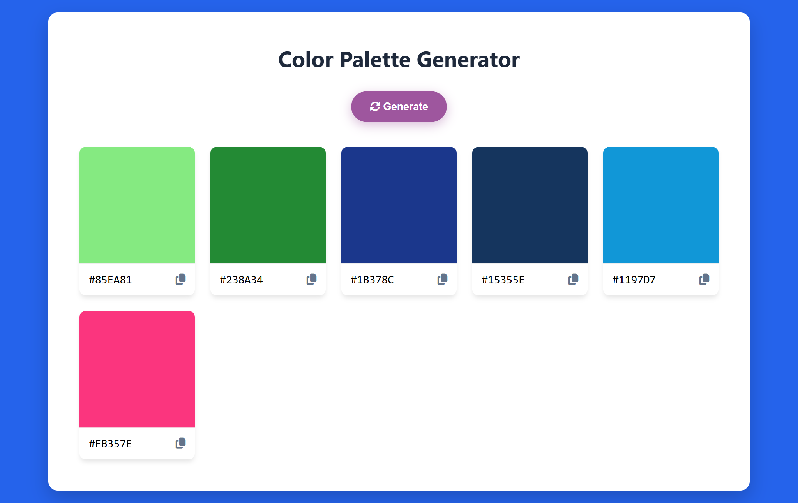

# 🎨 Color Palette Generator

A clean and interactive color palette generator built with
Vanilla JavaScript. Generate beautiful color combinations
instantly and copy hex codes with one click.

## ✨ Features

- Generate 6 random colors instantly
- Click any color box to copy hex code
- Copy icon with visual tick feedback
- Fully responsive — works on all screen sizes

## 🛠️ Tech Stack

- HTML5 (Semantic markup)
- CSS3 (Variables, Grid, Transitions)
- Vanilla JavaScript (ES6+)
- FontAwesome Icons
- Clipboard API

## 📸 Preview



## 🚀 Live Demo

[View Live Demo](https://mohsin777333.github.io/Projects-HTML-CSS-JAVASCRIPT-/Color%20Palette/)
)

## 💻 Run Locally

```bash
git clone https://github.com/MOHSIN777333/color-palette-generator
cd color-palette-generator
# Open index.html in browser
```

## 📁 Project Structure
